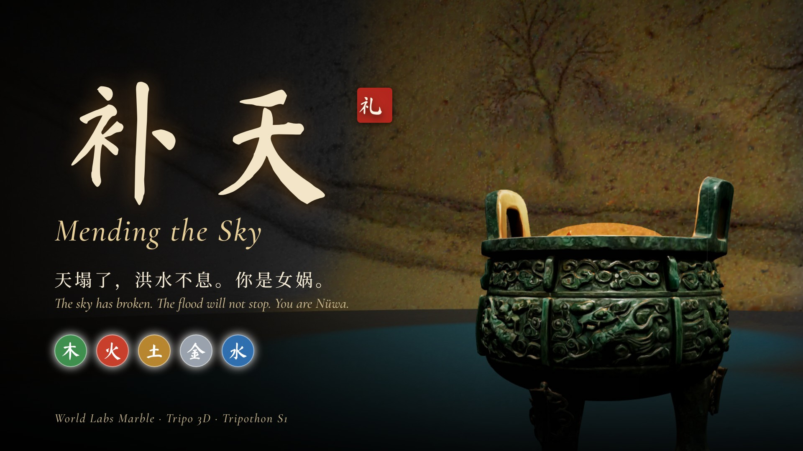
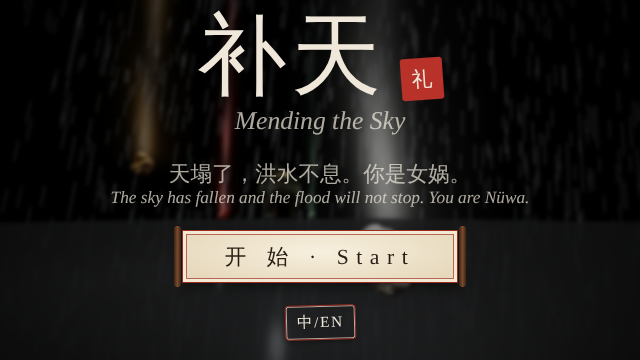
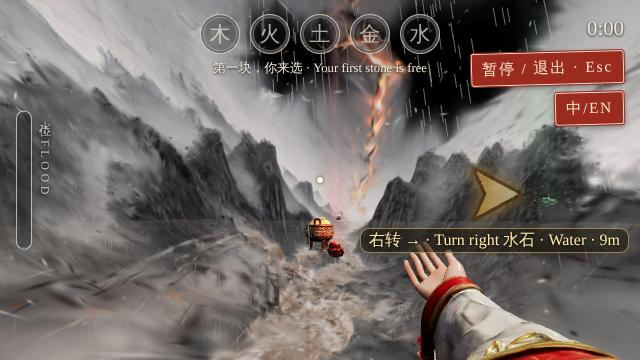
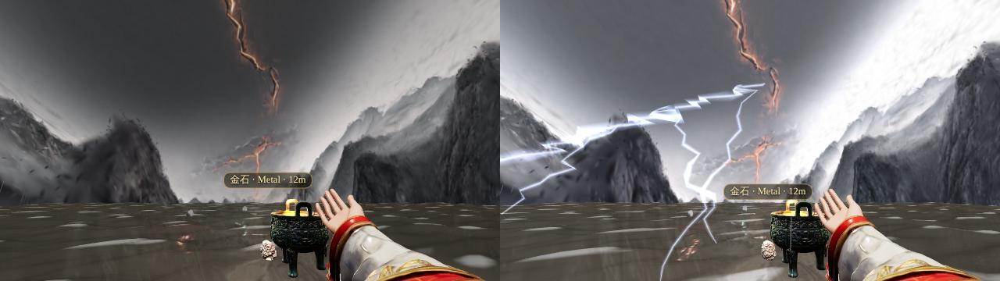
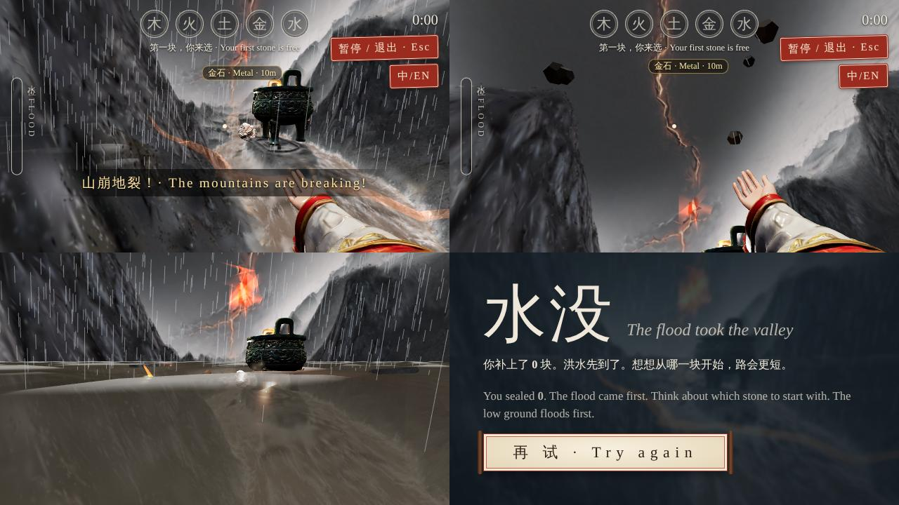
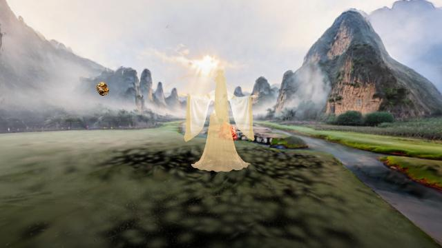
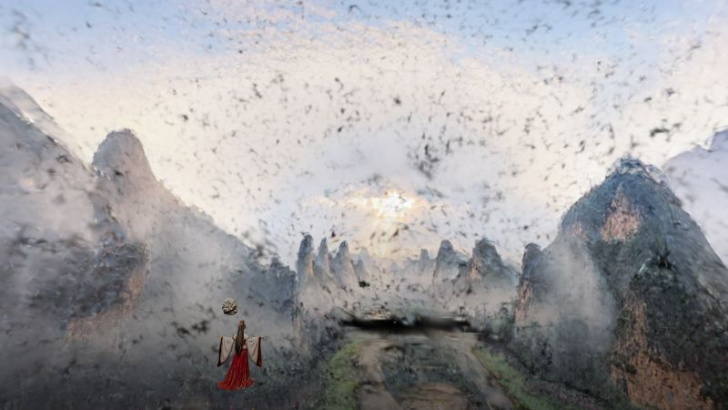
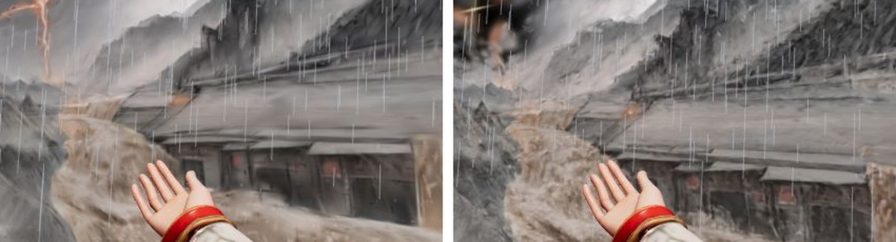

# 补天 Mending the Sky

天塌了，洪水不息。你是女娲：在洪水淹没山谷之前，找到五色石，按五行相生之序投入铜炉，炼石补天。

The sky has fallen and the flood will not stop. You are Nüwa: find the five stones, forge them in the order of the Five Phases, and mend the sky before the valley drowns.

- 在线试玩 Play：https://minusplus2025.github.io/butian/
- 自动演示 Autoplay demo：https://minusplus2025.github.io/butian/?demo
- Tripothon S1 参赛作品 · 游戏赛道 + Tripo、World Labs 工具赛道 · 黑客松 Demo，持续迭代中

## 操作 Controls

WASD 移动 · 鼠标环顾 · Shift 冲刺 · 空格跳 · E 或左键 拾石 / 投炉 · L 切换语言 · Esc 暂停

## 制作 How it's made

- **世界 Worlds**：World Labs Marble 生成的两个 Gaussian splat 山谷，灾难山谷（A）与修复后的同一山谷（B），各 200 万点（`assets/worldA_hi.spz`, `assets/worldB_hi.spz`），碰撞网格 `assets/collider.glb`
- **物件 Objects**：Tripo 生成的五色石、青铜鼎、女娲与汉服袖手臂（`assets/*.glb`）
- **声音 Audio**：ElevenLabs 生成的配乐、雨声、雷声与音效
- **渲染 Rendering**：three.js + Spark；洪水、天裂明灭、闪电、补天光波都直接在 splat 上实时计算
- **源码 Source**：`source/`（`src/` 源码，`tools/` 构建脚本，`test/` 测试脚本，`docs/` 文档），用 esbuild 打包成单个 `index.html`

## 截图 Screenshots

**开始 Title**

**灰色的末日山谷，跟着标记去找五色石 · Follow the marker through the drowning valley**

**闪电照亮整个山谷 · Lightning lights the whole valley**

**地震、洪水与失败结局 · Quakes, the rising flood, and the lost ending**

**女娲身归天地，补好的山谷 · Nüwa returns to the world she mended**

**补好的山谷：World Labs Marble 生成的修复世界 · The mended valley, a second Marble world**

**高清世界前后对比（左：50 万点，右：200 万点）· Before and after full-density worlds**

